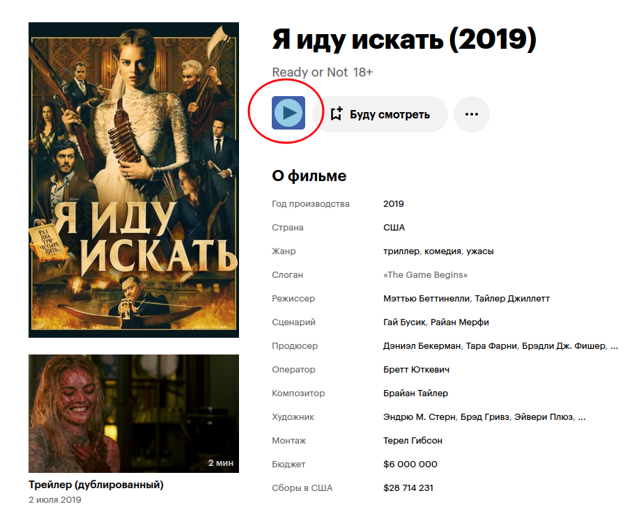
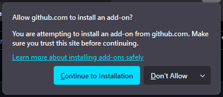
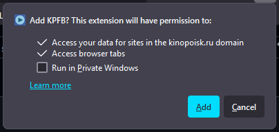
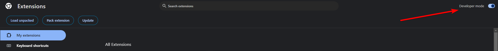
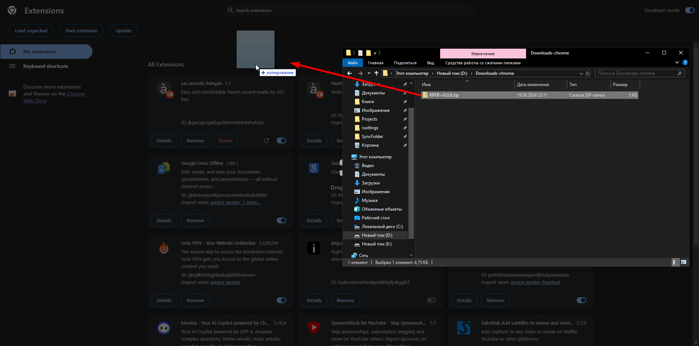

# About

**KPFB** - browser extension that adds a button to any [kinopoisk](https://www.kinopoisk.ru) film page. When the button was clicked it will open [flicksbar's](https://www.flicksbar.mom/) page for corresponding film.

# Installation

If you are using `Firefox` see [this](#firefox).

If you are using `Chrome` or any [chromium based browser](https://www.google.com/search?q=chromium+based+browsers) see [this](#chrome).

## Firefox

-   Download `xpi` from [the latest release](https://github.com/Clovis1444/KPFB/releases/latest)
-   Press `Continue to Installation` in the popup window

    

-   Press `Add` in the next popup window

    

## Chrome

-   Download `zip` archive from [the latest release](https://github.com/Clovis1444/KPFB/releases/latest)
-   Go to `chrome://extensions/`
-   Turn on **Developer mode**

    

-   Drag and drop `zip` to `chrome://extensions/` page

    

# Deprecated versions

-   [KPFB for firefox](https://github.com/Clovis1444/KPFB-firefox)
-   [KPFB for chrome](https://github.com/Clovis1444/KPFB-chrome)
